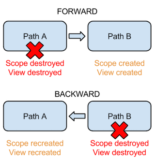
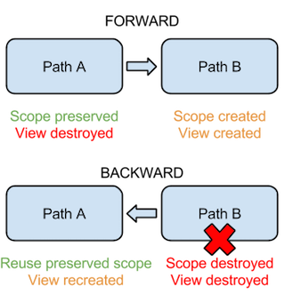

# Flow-navigation

Flow-navigation is an alternative library to Flow-path from Flow.  


### Why

Flow-path was extracted from Flow as an additional library, in order to provide convenient classes to work with screens and navigation. However Flow-path does not preserve the paths in Flow history.  

For instance, if we go from path A to path B, the scope associated with path A will be destroyed once we display path B. And when we go back to path A, the scope associated with A is recreated (and everything within, like the presenter).

With Flow-navigation, path A and its scope are not destroyed when we reach path B. It seems to be a more natural and logical way of navigation.

During FORWARD navigation, Flow-navigation preserves the scope and the view is still destroyed. In BACKWARD and REPLACE navigation, everything is destroyed like it should be.


### Worflow with Flow-path




### Workflow with Flow-navigation




## Use

The structure of Flow-navigation is very similar to the one of Flow-path. You basically need to replace the package import from flow.path to flownavigation. Classes like `Path` and `PathContainer` still exist and work in the same way than the ones from Flow-path.

In addition, Flow-navigation provides classes from Flow sample that can be reused often, like `@Layout` annotation (removed from Flow library), `SimplePathContainer` and `FramePathContainerView`.

You can check the sample in order to see details on a complete implementation of Flow-navigation with Flow / Mortar / Dagger2.


## Status

It's more an experiment than a library so far.  
It's working well in my first tests, but there might have many edge cases not covered.  
Feedback welcome.


## Installation

Flow-navigation is available on OSS sonatype.

```groovy
repositories {
	maven { url "https://oss.sonatype.org/content/repositories/snapshots" }
}

dependencies {
    compile 'com.github.lukaspili:flow-navigation:0.1-SNAPSHOT'
}
```

Flow-navigation uses an alternative dependency for Flow, which is up-to-date with the latest commit from Flow repository, also hosted on sonatype ([https://github.com/lukaspili/flow](https://github.com/lukaspili/flow)).

```groovy
repositories {
	maven { url "https://oss.sonatype.org/content/repositories/snapshots" }
}

dependencies {
	compile 'com.github.lukaspili:flow:0.9-SNAPSHOT'
}
```

## Mortar MVP

Mortar MVP is another experiment around Mortar and Flow.  
It focuses on removing the boilerplate code that requires the MVP pattern with Mortar / Flow / Dagger 2.  
Check it out here: [https://github.com/lukaspili/mortar-mvp](https://github.com/lukaspili/mortar-mvp)


## Author

- Lukasz Piliszczuk ([@lukaspili](https://twitter.com/lukaspili))


## License

Mortar MVP is released under the MIT license. See the LICENSE file for details.
